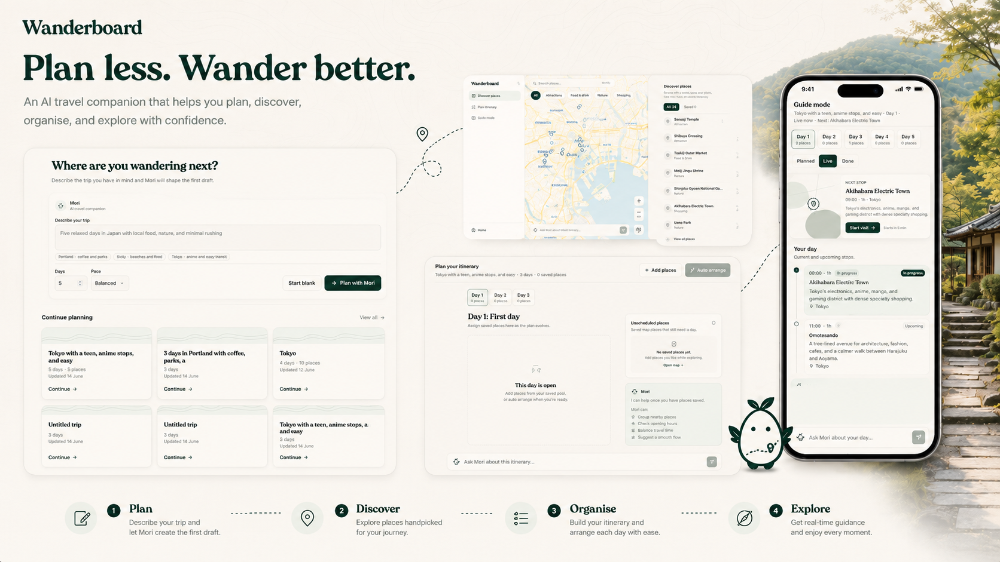

# Wanderboard

**Your AI travel board and on-the-go local guide.**

**Live demo:** [wanderboard-proto.vercel.app](https://wanderboard-proto.vercel.app)

Wanderboard is an AI-powered travel planning web app that turns scattered ideas, saved places, notes, and preferences into a clear, editable travel plan.

Instead of producing a rigid one-shot itinerary, Wanderboard treats travel planning as an ongoing process. Mori, Wanderboard’s AI travel companion, helps travellers discover places, organise realistic daily plans, and decide what to do next when the trip changes.

The traveller always remains in control. AI suggestions are presented as reviewable places, itinerary proposals, warnings, and guide actions rather than being applied silently.

---

## From Inspiration to a Usable Trip

### Plan with Mori

Start with a natural-language description of the trip. Mori uses the traveller’s destination, duration, interests, budget, pace, and constraints to create a structured starting point.

### Discover and Organise

Explore places visually, save promising ideas, and arrange them into practical daily plans. Places can be reviewed on the map, assigned to days, reordered, edited, or removed as the trip develops.

### Travel with Context

Guide Mode carries the existing plan into the trip itself. It helps the traveller understand what is planned, what is nearby, what still fits, and how the day can adapt without rebuilding the itinerary from scratch.

---

## What Wanderboard Does

- Describe a trip in natural language.
- Generate a structured and editable travel board.
- Discover attractions, food stops, activities, nature spots, and neighbourhoods.
- Preview suggested places on a map before saving them.
- Organise saved places into practical daily plans.
- Review estimated duration, cost, pace, and planning warnings.
- Ask Mori to improve an itinerary without losing the existing context.
- Preview proposed changes before applying them.
- Use Guide Mode during the trip for immediate, context-aware assistance.

> Cost, duration, travel-time, coordinate, and opening-hour information may be approximate. Travellers should verify current prices, closures, transport conditions, accessibility, entry requirements, and official opening hours before travelling.

---

## Mori Across Wanderboard

Mori changes role depending on where the traveller is working:

- **Plan and Discover:** suggests places and previews them on the map.
- **Day Itinerary:** proposes practical reordering, pacing, breaks, and schedule changes.
- **Guide Mode:** provides calm, context-aware help during the trip.

Read more in [Mori Experience](./docs/mori-experience.md).

---

## Microsoft IQ Integration

Wanderboard uses **Microsoft Foundry IQ** as its grounded destination-knowledge layer. Relevant destination knowledge is retrieved from an Azure AI Search knowledge base before Mori produces place suggestions, itinerary proposals, or contextual guidance.

Read more in [Microsoft IQ Integration](./docs/microsoft-iq.md).

---

## Demo Flow

The hosted demo uses Wanderboard’s server-side Microsoft Foundry resources. Reviewers do not need Azure credentials or access to the project’s Azure subscription.

1. Open the included Tokyo demo trip.
2. In **Plan and Discover**, ask Mori for a food or activity recommendation.
3. Review the suggested place card and preview it on the map.
4. Save the suggestion to the trip board.
5. Open **Day Itinerary** and ask Mori to make a busy day more relaxed.
6. Review the proposed changes, warnings, and supporting sources.
7. Apply the proposal and inspect the updated itinerary.
8. Open **Guide Mode** and ask Mori what to do next.

---

## Documentation

- [Mori Experience](./docs/mori-experience.md)
- [Microsoft IQ Integration](./docs/microsoft-iq.md)
- [Architecture](./docs/architecture.md)
- [GitHub Copilot Usage](./docs/copilot-usage.md)
- [Local Setup and Azure Provisioning](./docs/setup.md)
- [Security, Failure Handling, and Limitations](./docs/security-and-limitations.md)

---

## Tech Stack

| Layer | Technology |
|---|---|
| Framework | Next.js 16 with App Router |
| Language | TypeScript |
| Styling | Tailwind CSS v4 |
| State management | Zustand |
| Local persistence | `localStorage` |
| Maps | Leaflet, React Leaflet, OpenStreetMap |
| Model inference | DeepSeek deployment through Microsoft Foundry |
| Grounded retrieval | Microsoft Foundry IQ |
| Knowledge layer | Azure AI Search knowledge base |
| Validation | Zod |
| Icons | Lucide React |
| Hosting | Vercel |

---

## Why Wanderboard

Travel ideas rarely begin as clean itineraries. They begin as messages, screenshots, recommendations, map saves, personal notes, and disconnected plans.

Wanderboard gives those fragments a shared workspace.

Mori helps travellers discover and organise ideas, Foundry IQ provides relevant destination knowledge, and the traveller remains responsible for every persistent change.

The result is not a static AI itinerary. It is a living travel plan that remains useful before the trip, while plans are changing, and once the journey has already begun.
