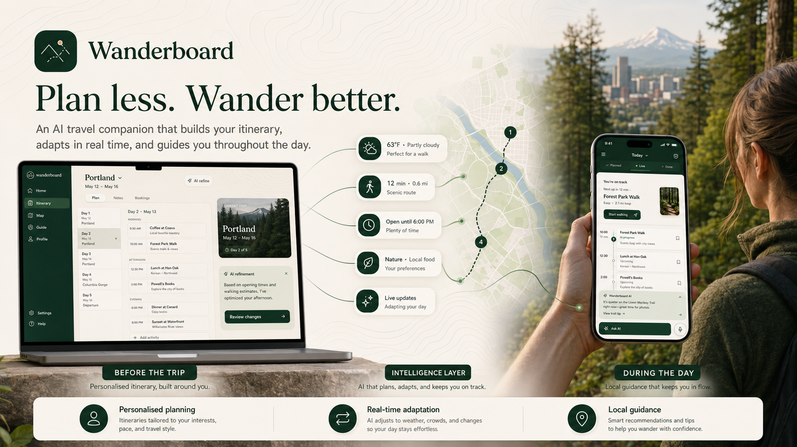
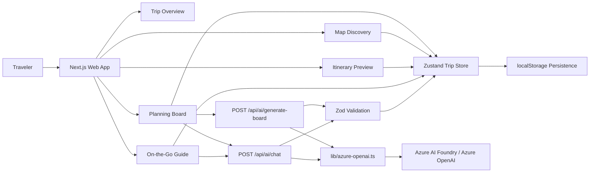
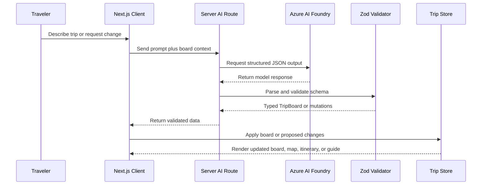
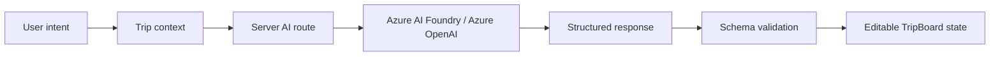

# Wanderboard

**Your AI travel board and on-the-go local guide.**



## Image References

- Guide page Sensoji Temple image: [Google Share](https://share.google/6hY3KnMKZmkhKE9IR) · Fallback: Unsplash photo `1542051841857-5f90071e7989`

Wanderboard is an AI-powered travel planning web app built around two connected experiences: a planning board before the trip, and a local guide during the trip. It turns scattered ideas, saved places, notes, and preferences into a structured travel board that stays editable as the trip evolves.

The goal is not to generate a rigid one-shot itinerary. Wanderboard treats trip planning as a creative process. AI helps organize the mess, but the traveler remains in control of the board, the map, the itinerary, and the decisions.

---

## What It Does

Wanderboard helps travelers move from early inspiration to a plan they can actually use.

- Start with a natural-language trip idea.
- Generate a structured travel board with places, days, cost ranges, notes, assumptions, and warnings.
- Save destinations, activities, food stops, nature spots, and custom ideas.
- Organize places by day, theme, location, or pace.
- Explore the trip visually on a map.
- Preview the board as an itinerary.
- Use the guide mode during the trip to understand what is next, what is nearby, and how the day can adapt.

Wanderboard is designed for weekend getaways, family vacations, food tours, outdoor escapes, and longer dream trips where inspiration starts messy and the final plan needs to stay flexible.

---

## Two Core Experiences

### 1. Planning Board

Planning mode is for the time before the trip. The user can describe what they want, collect ideas, save places, assign items to days, reorder plans, review practical notes, and shape the trip into an itinerary.

The planning board is map-first and editable. AI provides structure, suggestions, and refinements, but the board remains a living workspace rather than a static generated document.

### 2. On-the-Go Local Guide

Guide mode is for the time during the trip. It turns the plan into a practical local companion for the current day, showing what is planned, what is next, and what guidance may help the traveler stay in flow.

The guide experience is meant to answer questions like:

- What should I do next?
- What is close to me?
- What still fits today?
- What should I adjust if the day changes?
- What local context should I know before I go?

Together, these two experiences make Wanderboard more than an itinerary builder. It is a travel board that starts before the trip and continues as a local guide while the trip is happening.

---

## Architecture

Wanderboard is structured as a Next.js web app with a client-side planning workspace, server-side AI route handlers, and Azure AI Foundry / Azure OpenAI as the intelligence layer.

The core architectural idea is that AI should produce **structured travel data**, not just prose. The app is centered on a `TripBoard` model that can be rendered, edited, persisted, mapped, previewed, and reused across planning and guide surfaces.



A trip board contains:

- Destination and trip metadata
- Duration, pace, budget level, and interests
- Assumptions and warnings
- Saved places with coordinates, descriptions, notes, cost ranges, tags, and estimated duration
- Day shells with titles and summaries
- Day plans that assign saved places to specific days

This gives the product a stable backbone. The AI layer can generate or revise the board, but the user interface remains deterministic, inspectable, and editable.

### Data Flow



---

## How AI Is Used

Wanderboard uses AI as a structured planning layer, not as a generic chatbot.

### Board Generation

When a user describes a trip, Wanderboard sends the prompt and constraints such as destination, duration, pace, budget, and interests to a server-side AI route.

The AI returns a complete trip board with:

- Suggested places
- Approximate map coordinates
- Day assignments
- Cost ranges
- Practical notes
- Assumptions
- Warnings and check-before-you-go guidance

The result becomes an editable board, not a final answer.

### Board Refinement

When a user asks Wanderboard to adjust a plan, the app sends the current board context and the user request to the AI layer.

Instead of returning only advice, the AI proposes structured mutations, such as:

- Add new places
- Assign a place to a day
- Remove a place from a day
- Edit existing place details
- Explain what changed

This keeps the experience grounded in the board. AI suggests changes, while the product preserves user control.

### Local Guide Intelligence

Guide mode extends the same planning context into the trip itself. The long-term vision is for the guide to use the traveler’s current board, current day, saved places, preferences, and practical constraints to provide timely local guidance.

The guide should help the traveler adapt without starting over. If the day changes, Wanderboard can reason from the existing plan and suggest what still fits.

---

## AI Service Boundary

AI calls are isolated behind server-side routes under `src/app/api/ai/`. The browser never calls Azure directly and never receives credentials.

The AI layer is designed around a clear contract between product state and model output:

- The client sends user intent and current trip context.
- The server route builds a grounded planning request for Azure AI Foundry / Azure OpenAI.
- The model returns structured planning data, not freeform UI instructions.
- The server validates and cleans the response before returning it to the client.
- The client renders the result as editable board state.

This boundary keeps AI powerful but bounded. The model can help generate and revise plans, but the application decides how those plans are validated, rendered, stored, and edited.

### Route Responsibilities

- `POST /api/ai/generate-board` transforms an initial trip idea into a complete travel board.
- `POST /api/ai/chat` transforms a planning request into proposed edits for the current board.
- `GET /api/ai/health` checks whether AI is configured without exposing secrets.

At a high level, the routes share the same pattern:



### Azure AI Configuration

Azure AI Foundry / Azure OpenAI is configured through server-only environment variables:

| Variable | Purpose |
|---|---|
| `AZURE_OPENAI_ENDPOINT` | Azure OpenAI resource endpoint, for example `https://<resource>.openai.azure.com/` |
| `AZURE_OPENAI_API_KEY` | Secret API key for the Azure OpenAI resource |
| `AZURE_OPENAI_DEPLOYMENT` | Model deployment name created in Azure AI Foundry |
| `AZURE_OPENAI_API_VERSION` | API version, defaults to `2024-02-15-preview` |

The shared helper in `lib/azure-openai.ts` reads this configuration, creates the Azure OpenAI client, requests JSON schema structured output, parses the model response, and validates it before the route returns data to the client.

### Contract Shape

The route contract is intentionally product-level rather than chat-level.

For board generation, the input is a trip idea plus optional constraints such as destination, duration, pace, budget, and interests. The output is a complete `TripBoard` that the app can render across the planner, map, itinerary, and guide surfaces.

For board refinement, the input is the current `TripBoard` plus a user request. The output is a set of proposed board changes, such as adding places, assigning places to days, unassigning places, or editing place details.

For health checks, the output is only whether AI configuration is available. It never exposes API keys, endpoints, or secret values.

If a request is invalid, Azure is unavailable, content is filtered, or the model response cannot be validated, the route returns a typed error state that the UI can handle directly.

---

## Microsoft IQ Integration

Wanderboard uses Azure AI Foundry / Azure OpenAI as the intelligence layer for structured travel planning. The app follows a Foundry IQ-style architecture: user goals, trip constraints, saved places, day plans, and current board context are used as grounding input for AI generation and refinement.

The important design choice is that AI output is not treated as unstructured text. Wanderboard asks the model for validated planning data that can become editable product state. This makes the AI layer useful for real workflows: generating trip boards, suggesting places, refining day plans, surfacing assumptions, and helping the traveler adapt during the trip.

All AI calls happen on the server. API keys stay in environment variables and are never exposed through `NEXT_PUBLIC_*` configuration.

---

## Tech Stack

| Layer | Technology |
|---|---|
| Framework | Next.js 16, App Router |
| Language | TypeScript |
| Styling | Tailwind CSS v4 |
| State | Zustand |
| Persistence | localStorage |
| Maps | Leaflet, react-leaflet, OpenStreetMap |
| AI | Azure AI Foundry / Azure OpenAI via server-side routes |
| Validation | Zod |
| Icons | Lucide React |

---

## Project Structure

```text
src/app/
  page.tsx                  Home and trip overview
  planner/                  Planning board experience
  itinerary/                Itinerary review experience
  map/                      Map discovery experience
  guide/                    On-the-go local guide experience
  api/ai/                   Server-side AI routes

src/components/
  home/                     Home and overview components
  planner/                  Board, map, place, and day planning UI
  itinerary/                Itinerary cards and preview UI
  map-discovery/            Search, filters, markers, and place sheet
  guide/                    Today view and local guide components
  shared/                   Reusable UI primitives

src/stores/
  trip-store.ts             Zustand state and localStorage persistence

src/data/
  Demo trip, home, map, itinerary, and guide data

lib/
  azure-openai.ts           Server-side Azure AI client and structured output helper
  trip-types.ts             Core TripBoard data model
```

---

## Running Locally

### Prerequisites

- Node.js 18+
- npm or another compatible package manager

### Install and Run

```bash
npm install
npm run dev
```

Open [http://localhost:3000](http://localhost:3000).

The app can be explored with demo data without Azure credentials. AI-powered generation and refinement require Azure configuration.

### Build

```bash
npm run build
npm start
```

### Lint

```bash
npm run lint
```

---

## Optional Azure AI Setup

Create a `.env.local` file at the repository root:

```env
AZURE_OPENAI_ENDPOINT=https://<your-resource>.openai.azure.com/
AZURE_OPENAI_API_KEY=your-api-key-here
AZURE_OPENAI_DEPLOYMENT=<your-deployment-name>
AZURE_OPENAI_API_VERSION=2024-02-15-preview
```

You can copy the placeholder template:

```bash
cp .env.example .env.local
```

Then fill in your Azure values and restart the dev server.

---

## Security

- No Azure credentials are committed to this repository.
- Azure API keys belong only in `.env.local`.
- `.env.local` and other local environment files are ignored by git.
- Azure AI calls are made only through server-side route handlers.
- No `NEXT_PUBLIC_*` Azure variables are used.
- The app provides demo data so reviewers can explore the experience without requiring secrets.

---

## GitHub Copilot Usage

Wanderboard was built with meaningful GitHub Copilot assistance throughout the development process. Copilot was used to accelerate component scaffolding, TypeScript modeling, route handler implementation, structured AI response handling, UI iteration, debugging, and documentation.

The final product direction, architecture decisions, safety boundaries, and submission polish were human-directed.

---

## Submission Focus

Wanderboard is a creative application for the GitHub Copilot Creative Apps track. It combines AI-assisted development, structured travel intelligence, map-based planning, and a two-stage travel experience: planning before the trip and local guidance during the trip.

The central idea is simple: travel plans should not be trapped in static itineraries. They should behave like boards, shaped by inspiration, grounded by AI, and flexible enough to keep helping once the traveler is already on the go.
