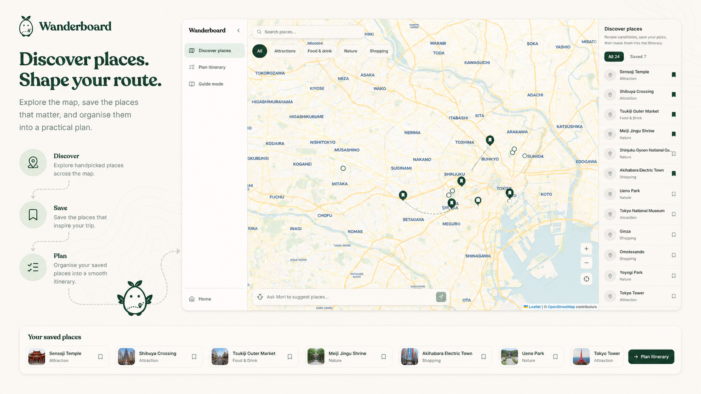
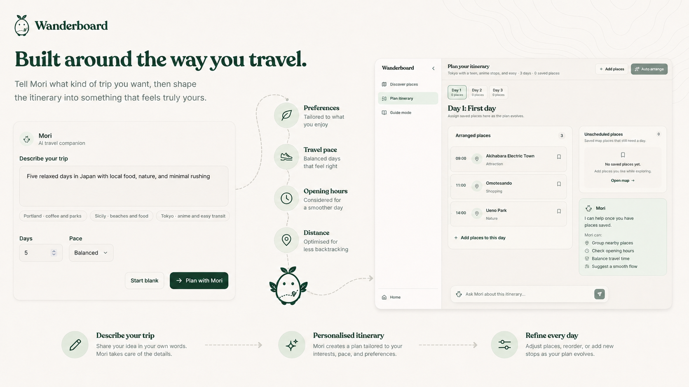
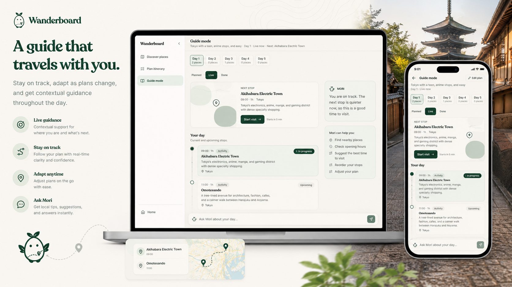
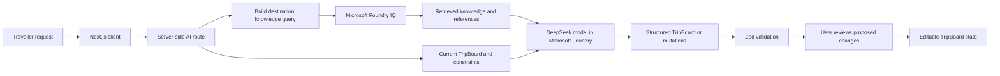
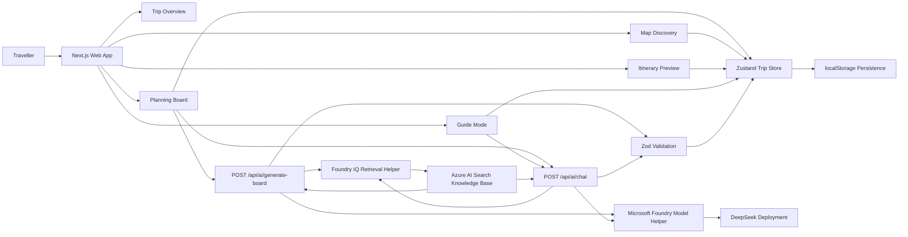
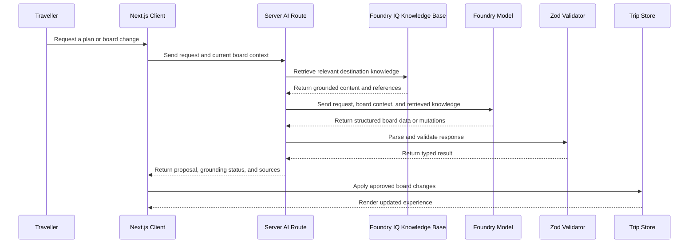

# Wanderboard

**Your AI travel board and on-the-go local guide.**


Wanderboard is an AI-powered travel planning web app that turns scattered ideas, saved places, notes, and preferences into a structured travel board that remains editable as the trip evolves.

Unlike a one-shot itinerary generator, Wanderboard treats travel planning as an ongoing creative process. Mori, Wanderboard's AI travel companion, helps organise ideas, retrieve relevant destination knowledge, and propose practical changes while the traveller remains in control of the final plan.

---

## From Inspiration to a Usable Trip



### Plan with Mori

Start with a natural-language description of the trip. Mori uses the traveller's destination, duration, interests, budget, pace, and constraints to generate a structured starting point.



### Discover and Organise

Explore places visually, save promising ideas, and arrange them into practical daily plans. Places remain editable and can be moved, reordered, assigned, or removed as the trip develops.



### Travel with Context

Guide Mode carries the planning context into the trip itself. It presents the active day, upcoming places, saved information, and board-aware assistance without forcing the traveller to start a separate conversation.

---

## What Wanderboard Does

Wanderboard helps travellers move from early inspiration to a plan they can actually use.

* Describe a trip in natural language.
* Generate a structured and editable travel board.
* Save attractions, food stops, activities, nature spots, and custom ideas.
* Organise saved places into daily plans.
* Review assumptions, estimated costs, durations, and planning warnings.
* Explore saved places visually on an interactive map.
* Preview the board as a practical itinerary.
* Ask Mori to refine the plan using the existing board as context.
* Use Guide Mode to follow the active day during the trip.

Wanderboard is designed for weekend getaways, family holidays, food trips, outdoor escapes, and longer journeys where inspiration begins messily but the final plan must remain understandable and flexible.

> Cost, duration, and travel-time values are planning estimates. Travellers should verify current opening hours, transport information, prices, accessibility, and entry requirements before travelling.

---

## Core Experience

### Planning Board

The Planning Board is the traveller's central workspace before the trip.

Instead of returning an itinerary as a block of generated text, Wanderboard stores the result as structured product state. Travellers can inspect places, assign them to days, reorder activities, add personal notes, and continue changing the plan after generation.

Mori can propose updates such as:

* Adding a relevant place
* Moving a place to another day
* Removing a place from a day
* Adjusting the pace of a day
* Editing notes or estimated visit details
* Explaining why a change may improve the plan

The traveller reviews and controls the resulting board.

### Map Discovery

The map provides a spatial view of the trip. Travellers can inspect where places are located, identify geographic clusters, and understand whether a proposed daily plan is spread across unrelated areas.

The map and planning views operate on the same saved-place data. Changes made in one surface are reflected across the board, map, itinerary, and guide.

### Itinerary Preview

The itinerary view converts the editable board into a clearer day-by-day presentation. It helps the traveller review the overall pace, daily groupings, notes, and unresolved warnings before the trip begins.

### Guide Mode

Guide Mode presents the current plan in a form intended for use during the trip. It focuses on the active day, what is coming next, and contextual information already attached to the board.

Mori can use the current board and grounded destination knowledge to answer planning questions without losing the traveller's existing trip context.

---

## Demo Flow

A reviewer can explore the application without connecting personal accounts or providing production credentials.

1. Open the included demo trip.
2. Review its saved places and daily arrangement.
3. Open the map to inspect how the places are distributed.
4. Ask Mori to make one of the days more relaxed.
5. Review the grounded explanation and proposed board changes.
6. Apply the changes to the board.
7. Open the itinerary to review the updated day.
8. Open Guide Mode to view the current-day experience.

AI generation and refinement require the Microsoft Foundry and Foundry IQ environment variables described below. The visual planning experience remains available through included demo data when cloud services are not configured.

---

## Microsoft IQ Integration

Wanderboard integrates **Microsoft Foundry IQ** as its grounded destination-knowledge layer.

Foundry IQ is used to retrieve relevant information from a curated travel knowledge base before Mori proposes changes to a trip. This reduces reliance on the model's general knowledge and gives the application a clearer distinction between retrieved destination information and model-generated planning judgement.

The Wanderboard knowledge base contains focused planning material for the demonstration destination, including:

* Neighbourhood and area context
* Suggested visit durations
* Reasonable nearby groupings
* Pacing guidance
* Local practical considerations
* Accessibility or etiquette notes where available
* Source titles, URLs, and review dates

When the traveller asks Mori to generate or revise a plan, Wanderboard sends a retrieval query based on:

* The traveller's request
* Destination
* Current trip duration and pace
* Selected day
* Saved and assigned places
* Relevant budget and interest constraints

Foundry IQ returns relevant knowledge and supporting references. This retrieved context is then supplied to the model deployment together with the current `TripBoard`.

The model produces structured board data or proposed mutations. Wanderboard validates that output before it can be returned to the client.



### Grounded and Ungrounded Responses

Wanderboard preserves the distinction between retrieved knowledge and model-generated suggestions.

When relevant knowledge is returned, Mori's response includes the supporting source metadata. When the knowledge base does not return a useful result, the application can continue using the current board context, but it marks the recommendation as an ungrounded planning suggestion that should be verified.

Foundry IQ does not directly modify the trip. It supplies destination knowledge to the planning workflow. The model proposes changes, the server validates them, and the traveller decides whether to apply them.

---

## How AI Is Used

Wanderboard uses AI as a structured planning layer rather than a generic chatbot.

### Board Generation

When a traveller describes a trip, the application sends the trip request and available constraints to a server-side route.

The model returns a complete `TripBoard`, which can contain:

* Destination and trip metadata
* Suggested places
* Approximate coordinates
* Day shells and assignments
* Estimated cost ranges
* Planning notes
* Assumptions
* Warnings
* Check-before-you-go guidance

The returned board is validated and then rendered as editable application state.

### Board Refinement

For subsequent requests, the application sends the current board together with the traveller's instruction.

Rather than returning only prose, the model proposes typed mutations such as:

* `addPlace`
* `editPlace`
* `assignPlaceToDay`
* `unassignPlaceFromDay`
* `reorderDayPlaces`
* `updateDaySummary`

Each response can also include:

* An explanation of the proposed change
* Its grounding status
* Supporting sources
* Warnings that require traveller verification

The model cannot directly modify browser state. Proposed mutations must pass server-side validation before the client can review or apply them.

---

## Architecture

Wanderboard is a Next.js application with a client-side planning workspace, server-side AI routes, Microsoft Foundry model inference, and Foundry IQ retrieval through an Azure AI Search knowledge base.

The application is centred on a structured `TripBoard` model. The same state can be rendered, edited, persisted, mapped, previewed, and reused across the planning and guide experiences.



### Request Flow



### AI Service Boundary

All cloud calls are isolated behind server-side routes under `src/app/api/ai/`.

The browser never receives Microsoft Foundry, Azure AI Search, or model credentials.

At the service boundary:

1. The client submits user intent and relevant board context.
2. The server retrieves destination knowledge through Foundry IQ.
3. The server builds a constrained model request.
4. The model returns structured output.
5. Zod validates and cleans the response.
6. The client receives a typed result that it can safely render.
7. The user controls whether proposed changes are applied.

### Route Responsibilities

| Route                         | Responsibility                                                                   |
| ----------------------------- | -------------------------------------------------------------------------------- |
| `POST /api/ai/generate-board` | Generates an initial structured trip board                                       |
| `POST /api/ai/chat`           | Produces grounded explanations and proposed board mutations                      |
| `GET /api/ai/health`          | Reports whether required AI services are configured without exposing credentials |

---

## Core Data Model

A `TripBoard` contains:

* Destination and trip metadata
* Duration
* Travel pace
* Budget level
* Interests and preferences
* Assumptions
* Warnings
* Saved places
* Coordinates
* Descriptions and personal notes
* Estimated costs and visit durations
* Tags
* Day shells
* Day plans
* Place-to-day assignments

This structured model gives the application a stable product backbone. AI can generate and revise the data, but the UI remains deterministic, inspectable, and editable.

---

## GitHub Copilot Usage

Wanderboard was developed with meaningful GitHub Copilot assistance throughout design, implementation, debugging, and documentation.

Copilot supported the development process rather than defining the product independently. Product direction, interaction decisions, data boundaries, validation requirements, visual review, and final implementation choices remained human-directed.

| Development area       | How GitHub Copilot assisted                                                                      | Human contribution                                                    |
| ---------------------- | ------------------------------------------------------------------------------------------------ | --------------------------------------------------------------------- |
| Product modelling      | Helped translate requirements into typed `TripBoard`, place, day, and mutation models            | Defined the concepts, relationships, and permitted operations         |
| Component development  | Assisted with scaffolding planner, map, itinerary, and guide components                          | Directed layout, behaviour, visual hierarchy, and product consistency |
| State management       | Helped implement Zustand actions and persisted board state                                       | Selected the state model and verified cross-view behaviour            |
| AI routes              | Assisted with server route structure, request parsing, and typed responses                       | Defined the service boundary and model responsibilities               |
| Structured output      | Helped implement schema-constrained output and Zod validation                                    | Defined accepted fields and failure behaviour                         |
| Foundry IQ integration | Assisted with Azure resource scripts, retrieval requests, response parsing, and citation mapping | Selected the knowledge scope and verified retrieved content           |
| Debugging              | Helped investigate TypeScript, hydration, state, map, and API integration issues                 | Reproduced problems and validated the final fixes                     |
| Documentation          | Helped refine setup instructions and Mermaid diagrams                                            | Checked all documented behaviour against the implementation           |

Examples of meaningful Copilot-assisted work include:

* Converting the trip-planning requirements into a reusable state model
* Designing typed model mutations rather than applying freeform AI instructions
* Creating validation and fallback paths for malformed model responses
* Integrating Foundry IQ retrieval into the existing server-side model workflow
* Refactoring repeated interface elements into reusable components
* Producing and reviewing local setup and Azure provisioning scripts

---

## Tech Stack

| Layer                           | Technology                                    |
| ------------------------------- | --------------------------------------------- |
| Framework                       | Next.js 16 with App Router                    |
| Language                        | TypeScript                                    |
| Styling                         | Tailwind CSS v4                               |
| State management                | Zustand                                       |
| Local persistence               | `localStorage`                                |
| Maps                            | Leaflet, React Leaflet, OpenStreetMap         |
| Model inference                 | DeepSeek deployment through Microsoft Foundry |
| Grounded retrieval              | Microsoft Foundry IQ                          |
| Knowledge storage and retrieval | Azure AI Search knowledge base                |
| Validation                      | Zod                                           |
| Icons                           | Lucide React                                  |

---

## Project Structure

```text
src/
  app/
    page.tsx
    planner/
    itinerary/
    map/
    guide/
    api/
      ai/
        generate-board/
        chat/
        health/

  components/
    home/
    planner/
    itinerary/
    map-discovery/
    guide/
    shared/

  stores/
    trip-store.ts

  data/
    demo/
    knowledge/

  lib/
    ai/
      foundry-model.ts
      foundry-iq.ts
      prompts.ts
      schemas.ts
    trip-types.ts

scripts/
  azure/
    provision.sh
    upload-knowledge.ts
    create-search-assets.ts
    verify-foundry-iq.ts
```

The exact structure may differ slightly as the project evolves, but AI inference and retrieval remain isolated from client components.

---

## Running Locally

### Prerequisites

* Node.js 18 or newer
* npm or another compatible package manager
* An Azure subscription for cloud-powered AI features
* Azure CLI for provisioning or inspecting Azure resources

### Install and Run

```bash
npm install
npm run dev
```

Open:

```text
http://localhost:3000
```

The interface can be explored with included demo data without Azure credentials. AI generation, refinement, and grounded retrieval require additional configuration.

### Production Build

```bash
npm run build
npm start
```

### Lint

```bash
npm run lint
```

---

## Environment Configuration

Copy the environment template:

```bash
cp .env.example .env.local
```

Configure the values produced by the Azure provisioning process:

```env
FOUNDRY_MODEL_ENDPOINT=
FOUNDRY_MODEL_API_KEY=
FOUNDRY_MODEL_DEPLOYMENT=

AZURE_SEARCH_ENDPOINT=
AZURE_SEARCH_API_KEY=
AZURE_SEARCH_KNOWLEDGE_BASE=
AZURE_SEARCH_API_VERSION=2026-04-01
```

The implementation may use Microsoft Entra ID instead of API keys where supported. Local environment variables and credential files must never be committed.

Restart the development server after changing `.env.local`.

---

## Failure Handling

The application handles cloud-service failures as typed product states.

Possible failures include:

* Missing server configuration
* Foundry IQ retrieval failure
* No relevant grounded content
* Model timeout or unavailability
* Content filtering
* Invalid structured output
* Schema-validation failure

When retrieval does not produce useful knowledge, the application identifies the result as an ungrounded planning suggestion.

When the model response cannot be safely validated, Wanderboard does not apply the proposed changes.

---

## Security

* No Azure or Microsoft Foundry credentials are committed.
* Secrets are stored only in server-side environment variables.
* `.env.local` and similar local files are ignored by Git.
* Client components do not call Azure services directly.
* No Azure credentials use a `NEXT_PUBLIC_*` prefix.
* AI and retrieval routes validate incoming requests.
* Model responses are treated as untrusted input until validated.
* Demo data is included so reviewers can explore the product without receiving project credentials.
* The knowledge source contains curated public demonstration content rather than private customer information.

---

## Limitations

Wanderboard is a planning assistant, not a source of guaranteed real-time travel information.

The current prototype has the following limitations:

* Suggested coordinates may require place-service verification.
* Prices and visit durations are estimates.
* Opening hours and transport conditions may change.
* The curated knowledge base covers the demonstration scope rather than every destination.
* Guide Mode does not replace official safety, accessibility, visa, weather, or transport advice.
* Travellers should verify time-sensitive details with authoritative sources.

---

## Why Wanderboard

Travel ideas rarely begin as clean itineraries. They begin as messages, screenshots, saved map locations, recommendations, and disconnected notes.

Wanderboard gives those fragments a shared workspace.

Mori helps create and refine the plan, Foundry IQ supplies relevant destination knowledge, and the traveller remains responsible for the board. The result is not a static AI response, but a living trip plan that can continue supporting the traveller once the journey begins.
