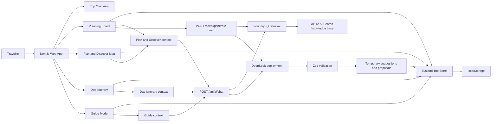
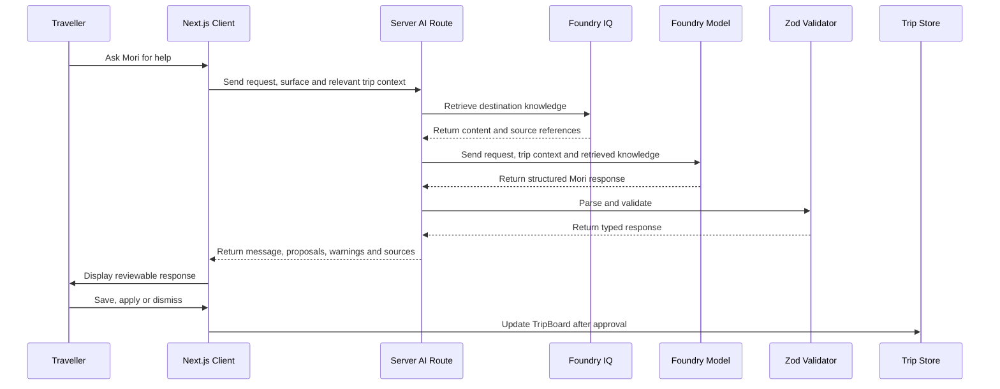

# Architecture

Wanderboard is a Next.js application with:

- A client-side planning workspace
- A shared Zustand trip store
- Local persistence
- Server-side Mori routes
- Microsoft Foundry model inference
- Foundry IQ retrieval through Azure AI Search
- Zod validation for AI-generated data

The application is centred around a structured `TripBoard`. The same trip state is shared across the planning board, map, itinerary, and guide experiences.



## Request Flow



## Service Boundary

All model and retrieval calls run through server-side Next.js routes.

Credentials remain outside the browser, retrieved sources are mapped by the server, and all model output is treated as untrusted until it passes Zod validation.

## Routes

| Route | Responsibility |
|---|---|
| `POST /api/ai/generate-board` | Generates an initial structured trip board |
| `POST /api/ai/chat` | Handles Plan and Discover, Day Itinerary, and Guide Mode requests |
| `GET /api/ai/health` | Reports safe configuration and availability status |

## Project Structure

Keep this section aligned with the real repository.

```text
src/
  app/
    page.tsx
    planner/
    itinerary/
    map/
    guide/
    api/
      ai/
        generate-board/
        chat/
        health/

  components/
    home/
    planner/
    itinerary/
    map-discovery/
    guide/
    mori/
    shared/

  stores/
    trip-store.ts

  data/
    demo/
    knowledge/

  lib/
    ai/
      prompts/
      foundry-iq.ts
      build-retrieval-query.ts
      schemas.ts
    trip-types.ts

scripts/
  azure/
    discover.sh
    provision-foundry-iq.sh
    create-search-assets.ts
    verify-foundry-iq.ts
```
