# Microsoft IQ Integration

Wanderboard uses **Microsoft Foundry IQ** as its grounded destination-knowledge layer.

Before Mori proposes a place, itinerary change, or contextual recommendation, Wanderboard can retrieve relevant information from a curated travel knowledge base hosted through Azure AI Search.

## Knowledge Scope

The knowledge base currently focuses on Tokyo, the demonstration destination, and includes:

- Neighbourhood context
- Suggested visit durations
- Reasonable nearby groupings
- Pacing guidance
- Practical transport considerations
- Accessibility and etiquette notes where available
- Source titles and URLs
- Last-reviewed dates

## Retrieval Context

A retrieval query is built from relevant trip context, including:

- The traveller’s request
- Destination
- Current travel pace
- Selected day
- Saved and assigned places
- Interests and budget constraints
- Relevant itinerary warnings

Foundry IQ returns destination knowledge and supporting references. This information is supplied to the model together with the relevant `TripBoard` context.

The model then produces a structured response containing conversational text and, where appropriate, place suggestions, itinerary proposals, guide actions, or warnings.

All output is validated before it is returned to the client.

```mermaid
flowchart LR
  User[Traveller request] --> Client[Next.js client]
  Client --> Route[Server-side Mori route]

  Route --> Query[Build retrieval query]
  Query --> IQ[Microsoft Foundry IQ]
  IQ --> Knowledge[Grounded knowledge and references]

  Route --> Context[Relevant TripBoard context]
  Knowledge --> Model[DeepSeek model in Microsoft Foundry]
  Context --> Model

  Model --> Response[Structured Mori response]
  Response --> Validation[Zod validation]
  Validation --> UI[Message, cards, proposals, warnings and actions]
  UI --> Approval[Traveller reviews or applies changes]
  Approval --> Store[Editable TripBoard state]
```

## Grounding Status

Wanderboard preserves the distinction between retrieved knowledge and model-generated planning judgement.

A response may be presented as:

- **Grounded:** supported by retrieved destination knowledge
- **Partly grounded:** some details are retrieved while others remain planning judgement
- **Planning suggestion:** based on the current board and model reasoning without a relevant retrieval result
- **Knowledge unavailable:** retrieval could not be completed

Supporting sources are displayed separately from Mori’s main conversational reply.

Foundry IQ never modifies the trip directly. It provides destination knowledge to the planning workflow. The model proposes actions, the server validates them, and the traveller decides whether to apply them.
